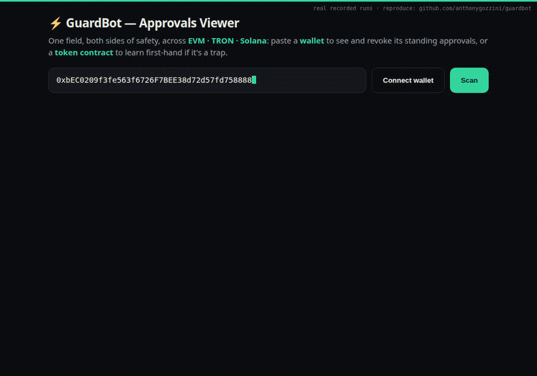

# GuardBot ⚡ — pre-trade safety for agents & bots

<p align="center"><a href="https://anthonygozzini.github.io/guardbot/demo.html"></a></p>
<p align="center"><b><a href="https://anthonygozzini.github.io/guardbot/demo.html">▶ Interactive 35-second demo</a></b> — real recorded runs, reproducible from this repo.</p>

One paste field, two questions, three ecosystems (**EVM · Solana · TRON**):

- **"Is this token a trap?"** — GuardBot *actually buys and sells it* in a simulation against
  live liquidity. No vendor API. Verdict: `safe / warn / block`, each check with its evidence.
- **"What did this wallet already approve?"** — every standing approval in one table, across
  chains no single revoke tool unifies. Then revoke it: your wallet signs, and the effect is
  proven on-chain *before* you sign.

## Try it — 2 minutes, zero dependencies

Python stdlib only. No pip install, no keys, no account. Everything runs on your machine.

```bash
git clone https://github.com/anthonygozzini/guardbot && cd guardbot
python3 guardd.py            # open http://127.0.0.1:8403/view
```

- Paste a **token contract** → safety verdict.
- Paste a **wallet** → its approvals, with Revoke buttons.
- **Connect a wallet** → one QR opens one WalletConnect session for EVM + Solana + TRON together
  (needs a free projectId: `GUARDBOT_WC_PROJECT_ID=<id> python3 guardd.py`).

From the CLI or as an agent tool:

```bash
python3 tokencheck.py bsc 0x<token>       # is it a trap?
python3 approvals.py  0x<wallet>          # what has it approved? (also T… / Solana base58)
python3 mcp_server.py                     # MCP: check_token + check_approvals for agents
```

## Why trust the verdicts

- **The buy and sell are real.** A state-override `eth_call` gives a throwaway address native
  coin and trades the token atomically against the live pool. Sell reverts → honeypot. Money
  missing from the round trip → that *is* the tax.
- **A failure must prove itself.** Every failed sell is re-run against a control token on the
  same node in the same moment; if the control fails too, the observation is discarded. The whole
  analysis is pinned to one block. (Without this, USDT got branded a honeypot. Twice.)
- **Names are never trusted.** Among 1,209 real approved BSC tokens, four call themselves "USDT".
  Identity comes from a mined per-chain registry of who *actually* trades under a ticker, judged
  by liquidity ratio — and lookalike characters are folded first (`homoglyphs.py`), so a ticker
  that only *renders* as USDT fails for the disguise itself.
- **Measured:** 5/5 known honeypots blocked, 0 false positives in 20 consecutive runs on
  CAKE/USDT/BUSD/WBNB, round trips land at exactly the pool fee ×2. A user-supplied test set of
  4 live fakes → all `block`, each for its own reason; one of them is shown as **PASSED** by
  honeypot.is.
- **Solana and TRON are read first-hand too:** mint/freeze authorities and Token-2022 extensions
  (permanent delegate, transfer hook, transfer fee); TRON bytecode scanned for
  seize/blacklist/mint powers.

## Revoking

- Only **three calls** can ever be built, zeroes hard-coded: `approve(spender, 0)`,
  `setApprovalForAll(op, false)`, `Permit2.approve(token, spender, 0, 0)`. No transfer, no
  arbitrary call, no path around it.
- The page shows the exact call, contract, chain and calldata **before** anything is signed.
  Your wallet signs one transaction at a time; the server never sees a key.
- **Proven before signing:** the revoke is executed in simulation and the permission re-read at
  zero. "✓ simulated" appears only when the node actually did it.
- **Proven for real:** EVM revokes signed and confirmed on mainnet; Solana and TRON revokes
  landed on their testnets, signed by this repo's own stdlib ed25519/secp256k1 signer
  (`tools/testnet_e2e.py`, self-tested against the RFC 8032 reference vectors).
- Worth knowing: zeroing your ERC-20 approval *to* Permit2 does **not** clear grants already
  inside Permit2. GuardBot reads and revokes those separately.

## Coverage and speed

| Chain | History | Verdict engine |
|---|---|---|
| Ethereum, Arbitrum, Polygon | full logs (free Etherscan tier) | buy/sell simulation |
| Base | full logs (Blockscout, keyless) | buy/sell simulation |
| Optimism | free-RPC log scan | buy/sell simulation (Velodrome) |
| BSC | probe (96.6% coverage) **+ automatic deep scan** | buy/sell simulation |
| Solana | SPL delegates via RPC | mint/extension reading |
| TRON | TronScan + TronGrid | bytecode power scan |

- Live multi-chain scan ≈ 2s on a normal wallet; cached re-open in microseconds (local
  incremental index in `~/.guardbot` — private, never uploaded).
- BSC publishes no free log history, so it is probed against a chain-mined candidate universe —
  and the first scan of each wallet auto-starts a one-time **deep scan** that walks the wallet's
  own transactions (an `approve` is always a transaction the owner signed). Verified: matches
  revoke.cash to the decimal on a wallet the probe alone missed.
- Anything unreadable is labelled `partial` or `probed` on screen. Never silently dropped.

## Honest limits

- "LP burned" is checked; third-party LP lockers are not — a locked-but-unburned LP reads as a
  caution.
- No holder-distribution check on EVM (Solana has concentration).
- Relayer-executed EIP-2612 permits leave no owner transaction, so the BSC deep scan cannot see
  them (the Permit2 kind is probed).
- The first scan of a busy wallet is slow on free public RPCs (~30–90s). Re-scans are instant.
- Mined data (registries, probe universes) ages; the UI shows its age and
  `python3 tools/refresh.py` re-mines everything.

## Tests

```bash
python3 -m unittest discover -s tests                    # 51 offline tests, ~0.3s
GUARDBOT_LIVE=1 python3 -m unittest discover -s tests    # + 19 live tests on real chains
```

Many are regressions for bugs that actually shipped here. The testnet signing proof is
`python3 tools/testnet_e2e.py solana|tron` — throwaway local key, zero value at risk.

## Configuration (all optional)

| Env var | Effect |
|---|---|
| `GUARDBOT_PORT` | port (default 8403) |
| `GUARDBOT_HOST=0.0.0.0` | expose on your LAN (phone in the same Wi-Fi); default loopback |
| `GUARDBOT_WC_PROJECT_ID` | enables WalletConnect (free id from cloud.reown.com) |
| `GUARDBOT_ETHERSCAN_KEY` | free; speeds up log history on eth/arbitrum/polygon |
| `GUARDBOT_SOLANA_RPC` / `GUARDBOT_TRON_NETWORK` | point at testnets (devnet / nile) |
| `GUARDBOT_DEV_SEED=1` | serves `/dev/seed`, a testnet-only page to create test grants |
| `GUARDBOT_NO_CACHE=1` | disable the local index |

## Payments (x402) — off by default

The repo is free forever; humans never pay for safety. For a *hosted* deployment there is a real
x402 rail: unpaid calls get HTTP 402 with the price, an agent pays USDC through a facilitator
(`/verify` + `/settle`, replay-guarded), and the paid endpoint serves the same first-hand
engines. Missing facilitator → paid calls are rejected, never faked.

```bash
GUARDBOT_PRICE_USDC=0.01 GUARDBOT_NETWORK=base-sepolia \
GUARDBOT_FACILITATOR=<url> GUARDBOT_PAY_TO=0x<you> python3 guardd.py
```

## Files

- `tokencheck.py` / `solcheck.py` / `troncheck.py` — the first-hand safety engines
- `approvals.py` — multi-chain approvals scanner (+ local index)
- `revoke.py` — the three revoking calls + on-chain simulation
- `guardd.py` — HTTP daemon and `/view` UI · `mcp_server.py` — agent tools
- `homoglyphs.py` — lookalike-character folding · `keccak.py` — pure-Python keccak256
- `tools/` — miners (`mine_*.py`), `refresh.py`, `deepscan_bsc.py`, `testnet_e2e.py`

## References

- x402 payment protocol (the spec the payment rail implements) —
  https://github.com/x402-foundation/x402
- GoPlus address_security — https://docs.gopluslabs.io/reference/api-overview — used only as a
  reputation hint on spender addresses and as legacy fallback for uncovered chains; token
  verdicts are always produced first-hand.

This is a safety signal on public data, not financial advice.
